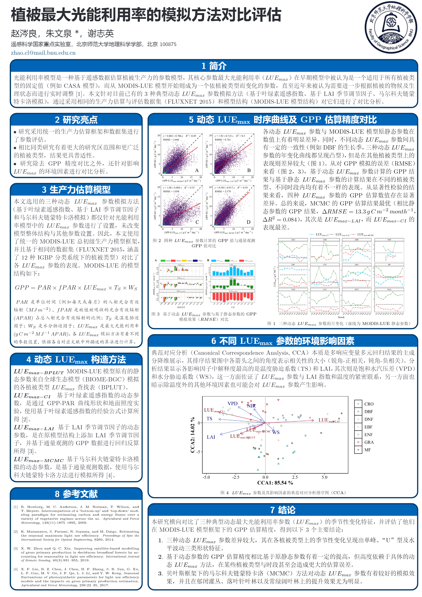

## Introduction
* This project contains the dataset and part of the code of an article on seasonal LUEmax simulation
 

### Article
* Title:  Comparative evaluation of simulation methods for vegetation maximum light use efficiency 
* Journal: National Remote Sensing Bulletin 
* Author: Cengliang Zhao, Wenquan Zhu*, Zhiying Xie
* DOI: [10.11834/jrs.20211394](http://www.ygxb.ac.cn/thesisDetails#10.11834/jrs.20211394&lang=en) 

### Poster

